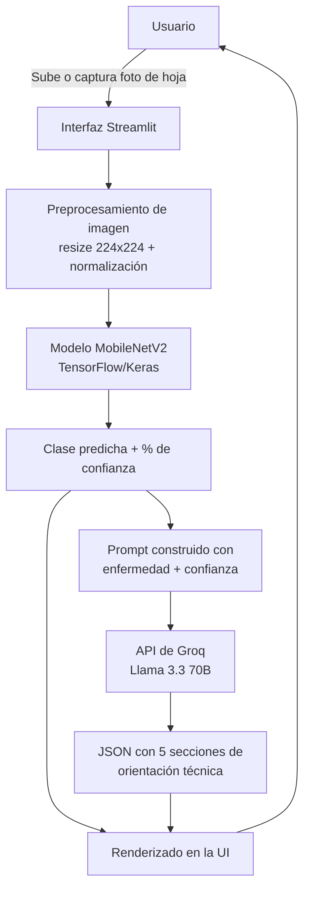

# Arquitectura del Sistema 

## 1. Visión general

Es un servicio web de diagnóstico foliar de café que combina un modelo de
**visión artificial** (clasificación de imágenes) con un modelo de **lenguaje** (generación
de texto) para entregar al caficultor no solo un diagnóstico, sino orientación técnica
accionable, todo desde el navegador y sin instalar nada.

## 2. Diagrama de flujo

## 3. Componentes

### 3.1 Capa de presentación — Streamlit
- Recibe la imagen del usuario (subida de archivo o cámara web).
- Muestra el resultado del diagnóstico, el % de confianza y las recomendaciones.
- Mantiene un historial de las últimas predicciones en la sesión del usuario
  (`st.session_state`, en memoria — no persiste entre sesiones).

### 3.2 Capa de inferencia — Modelo de visión (TensorFlow/Keras)
- Arquitectura: **MobileNetV2** preentrenada en ImageNet, usada como extractor de
  características (transfer learning), con un cabezal de clasificación propio
  (`GlobalAveragePooling2D → Dense(128) → Dropout → Dense(softmax)`).
- Entrenamiento en dos fases: (1) solo el cabezal con la base congelada, (2) fine-tuning
  de las últimas 30 capas de la base con tasa de aprendizaje baja.
- Entrenado y exportado en Google Colab; se carga en la app como archivo `.keras` local
  (no requiere llamadas externas para la inferencia — corre en el mismo proceso de la app).
- Entrada: imagen RGB 224×224. Salida: vector de probabilidades por clase (softmax).

### 3.3 Capa de generación de texto — API de Groq
- Modelo: `llama-3.3-70b-versatile`.
- Recibe la clase detectada, su nombre científico y el % de confianza.
- Devuelve un JSON estructurado en 5 secciones fijas (diferenciación visual, manejo
  agronómico, cuándo consultar a un técnico, monitoreo, y registro/trazabilidad), que se
  renderiza como tarjetas en la UI.
- Si la llamada falla (sin conexión, sin API key, error del servicio), la app entrega un
  mensaje de respaldo genérico en vez de romperse (`groq_service._fallback_guidance`).

### 3.4 Gestión de secretos
- La API key de Groq nunca se hardcodea en el código. Se lee de `st.secrets` en producción
  (Streamlit Community Cloud) o de la variable de entorno `GROQ_API_KEY` en local.

## 4. Servicios en la nube utilizados

| Servicio | Función en el proyecto |
|---|---|
| **Google Colab** | Entrenamiento del modelo de visión con GPU (T4), sin necesidad de hardware propio. |
| **Streamlit Community Cloud** | Hospedaje y despliegue continuo del servicio web (build automático desde GitHub). |
| **Groq Cloud (API)** | Inferencia del modelo de lenguaje (Llama 3.3 70B) para generar las recomendaciones técnicas. |
| **GitHub** | Control de versiones y disparador del despliegue en Streamlit Cloud. |

## 5. Flujo de funcionamiento (paso a paso)

1. El usuario abre la app en el navegador (URL pública de Streamlit Cloud).
2. Sube una foto de una hoja de café o la captura con la cámara del dispositivo.
3. Al presionar "Analizar Imagen", la app:
   a. Preprocesa la imagen (resize a 224×224, normalización con `preprocess_input` de MobileNetV2).
   b. Ejecuta la inferencia con el modelo Keras cargado en memoria (`@st.cache_resource`,
      se carga una sola vez por instancia del servidor).
   c. Obtiene la clase con mayor probabilidad y su % de confianza.
   d. Construye un prompt con esos datos y llama a la API de Groq.
   e. Recibe el JSON con las 5 secciones de orientación técnica.
4. La UI renderiza el diagnóstico (nombre, nombre científico, % de confianza) y las
   5 tarjetas de recomendaciones, además de agregar el resultado al historial de la sesión.

## 6. Decisiones de diseño relevantes

- **Modelo local vs. modelo en la nube para visión:** se optó por cargar el modelo
  `.keras` directamente en el proceso de Streamlit (en vez de exponerlo como un endpoint
  aparte) porque el modelo es liviano (~10-15 MB) y esto simplifica el despliegue a una
  sola app, cumpliendo el requisito de "servicio web funcional" sin infraestructura extra.
- **Separación de responsabilidades:** la lógica de Groq vive en un módulo aparte
  (`groq_service.py`) para que la integración de IA generativa sea fácil de auditar/evaluar
  de forma independiente de la UI, y para poder testear o cambiar de proveedor de LLM sin
  tocar `app.py`.
- **Degradación controlada:** si la API de Groq no responde, la app sigue funcionando y
  muestra un mensaje de respaldo en vez de un error sin manejar — importante para que el
  servicio esté "disponible y funcionando al momento de la evaluación" incluso ante fallas
  de red temporales.
